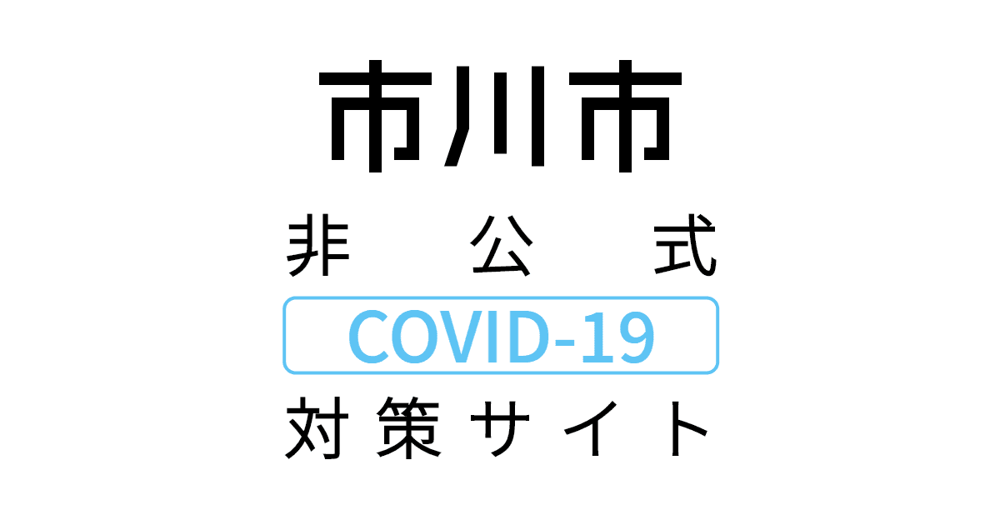
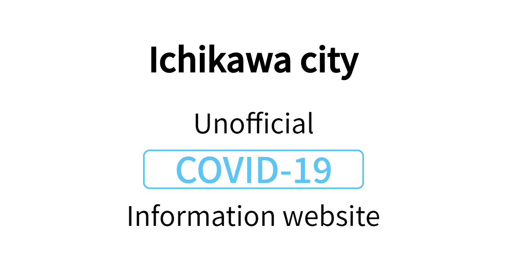

# 【非公式】市川市 新型コロナウイルス感染症対策サイト

<!-- img タグ同士が同一行に存在しないと，横並びになってくれない -->

- [https://stopcovid19-ichikawa.netlify.app](https://stopcovid19-ichikawa.netlify.app/)

## 行動原則

詳しくは，[サイト構築にあたっての行動原則](./CODE_OF_CONDUCT.md)をご覧ください。

## ライセンス

本ソフトウェアは，[MIT ライセンス](./LICENSE.txt)の下で提供されています。

## その他

- 当サイトは，[東京都 新型コロナウイルス感染症対策サイト](https://github.com/tokyo-metropolitan-gov/covid19)の派生プロジェクト（fork）の一つです。
- 当サイトのような派生プロジェクトの一覧につきましては，本家の [FORKED_SITES.md](https://github.com/tokyo-metropolitan-gov/covid19/blob/development/FORKED_SITES.md) をご参照ください。
